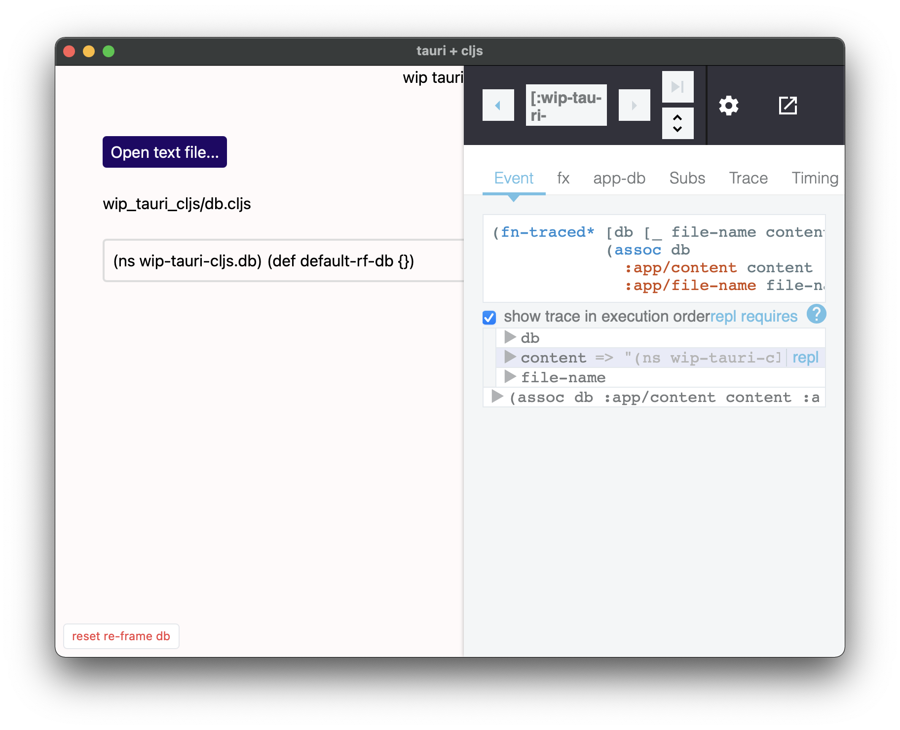

# work-in-progress [`tauri`] + [`cljs`]

## screenshots



## development setup

[setup macOS environment for tauri development](https://tauri.studio/en/docs/getting-started/setup-macos)

after 👆, you can use [`asdf`] to manage java and nodejs
(see the `.tool-versions` file in the root this repo)
or any other solution/approach, whatever works for you

## build

1. execute the following in a terminal on the host machine

```
npm install
```

2. then execute, in that same terminal, the following

```
npm run watch
```

3. execute the following in a different terminal on the host machine

```
npm run tauri dev
```

4. wait anywhere from 2 to 15 minutes (or longer 😅)

5. hopefully, see a window

## TODOs

- [ ] get [Calva] jack-in REPL connection working, currently getting this:
```
; Error while connecting cljs REPL: TypeError: Cannot read property 'search' of undefined
```

- [ ] get [`clj-kondo`]'s `lint-as` working

[`tauri`]: https://tauri.studio/en
[`cljs`]: https://clojurescript.org
[`asdf`]: https://asdf-vm.com
[Calva]: https://calva.io
[`clj-kondo`]: https://github.com/clj-kondo/clj-kondo
